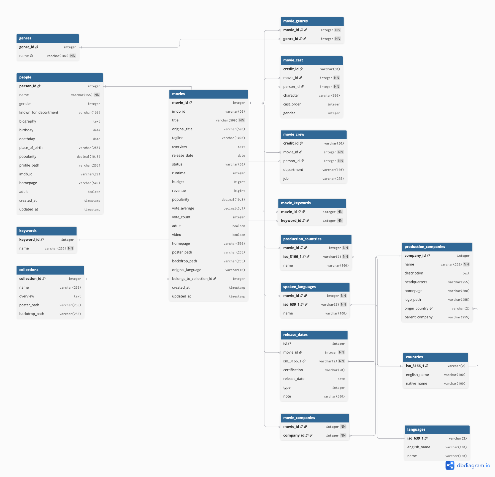

## 🎬 TMDB Database Schema + Ingestion

**[Data Dictionary (Google Docs)](https://docs.google.com/document/d/1CV-DElvKOjLBfyKnuJ3P1iOLmUA4N8z4Qms3wYUiUXs/edit?usp=sharing)** — Contains definitions, data types, and core schemas for this project.


A PostgreSQL schema and Python ingestion script for **The Movie Database (TMDB)** API.

## 📊 Schema Diagram



## 🗂️ What's Included

- **16 tables** for Movies + People + Dimensions
- **SQL DDL** for PostgreSQL
- **Python ingestion** to populate from TMDB API (Takes ~7 hours)

## 🚀 Quick Start

### 1. Setup Database

```bash
# Create database
createdb tmdb_db

# Run schema
psql -d tmdb_db -f schema/01_create_tables.sql

# Seed reference data
psql -d tmdb_db -f schema/02_seed_reference_data.sql
